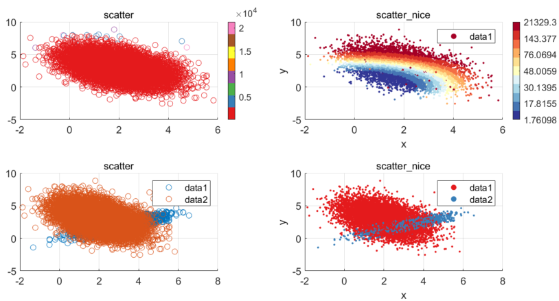

## scatter_nice

A wrapper for scatter(.) that
1) chooses useful defaults for colors and marker size and shape (adaptive to the number of points to be plotted),
2) allows for easy group-wise scatter plots,
3) implements randomized-order plotting to prevent the last plotted data to (misleadingly) dominate plot appearance,
4) uses nonlinear color scaling to exploit the full color range, and
5) implements some automatic simple statistical annotations to be shown (optionally).

The goal is for this to be a one-stop function to easily create a useful and visually appealing scatter diagram.

Requires the `cbrewer` file exchange function to be on the path, see 
https://www.mathworks.com/matlabcentral/fileexchange/34087-cbrewer-colorbrewer-schemes-for-matlab.
The file is included here for convenience; copyright remains with the original author.

The following are two examples comparing the default outputs of `scatter(.)` and `scatter_nice(.)`.
In the first example, the linear colormap used by `scatter` is completely useless due to a skewed distribution of data points.
`scatter_nice` fixes this by using an automatically balanced nonlinear colormap.
Moreover, outliers near the beginning of the input vector are completely invisible in the first plot since they are hidden by later datapoints.
Using `scatter_nice`, they are easily visible because of a) the nonlinear colormap and b) *randomized-order plotting*.
In the second example, simply plotting two groups after another (with `hold on`) using `scatter`, the second group will completely hide the first.
`scatter_nice` offers a simple interface for plotting multiple groups and plots them in *randomized order*.
In both examples, `scatter_nice` adaptively chooses a point size that is (to my eyes, at least) better suited to the number of datapoints, and selects a fitting and well-crafted colormap from `cbrewer`.

---
Eike Petersen, 2020-2021
